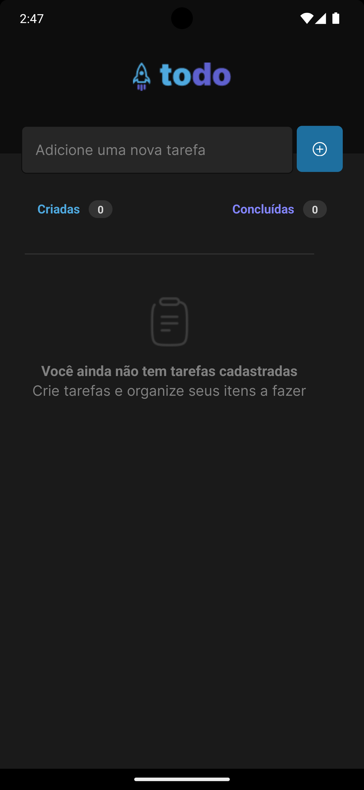
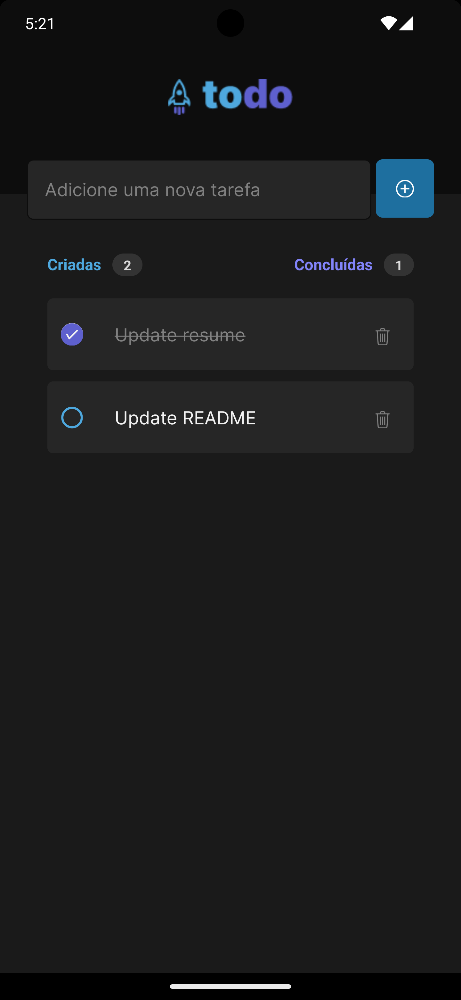

<h1 align="center">
  
</h1>

<br />

<h3 align="center">
  🎯 About Challenge 
</h3>

In this challenge, I will develop a task control application. An **to do list**, with the following functionalities:

- [x] add a new task
- [x] remove a task from the list
- [x] mark and unmark a task as completed or not

Even though there were few features, I practiced concepts such as:

- state management
- immutability of state
- lists and keys in react native
- properties
- componentization
- Async storage
  
<h3 align="center">
  💻 Technologies & Layout
</h3>

- [Expo](https://expo.dev/)
- [React Native](https://reactnative.dev/)

And the result achieved was:

<p align="center">
  
  
</p>

## :gear: If you want testing

```bash
### after clone repo, install the dependencies
$ npm i

### running application
$ npm run start

### If you can use a emulator, write "a" in terminal to run android emulator
### or use your device and scan the QRcode on terminal
```
See you later, bye 👋🏻!

Developed with ❤️ by [Vinicius de Souto](https://github.com/soutovnc)


